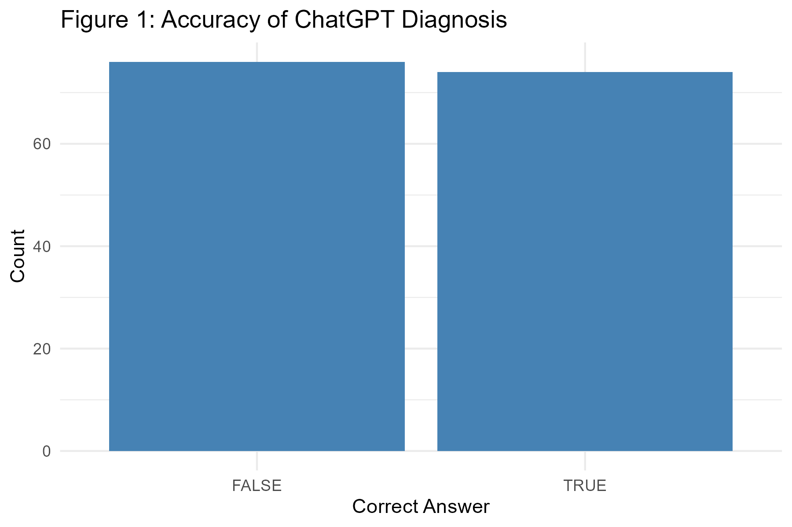
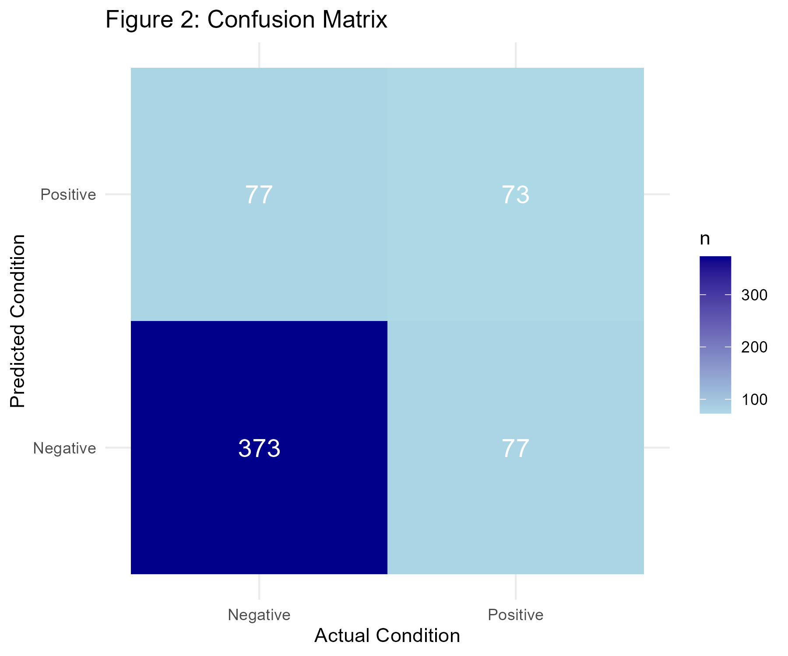
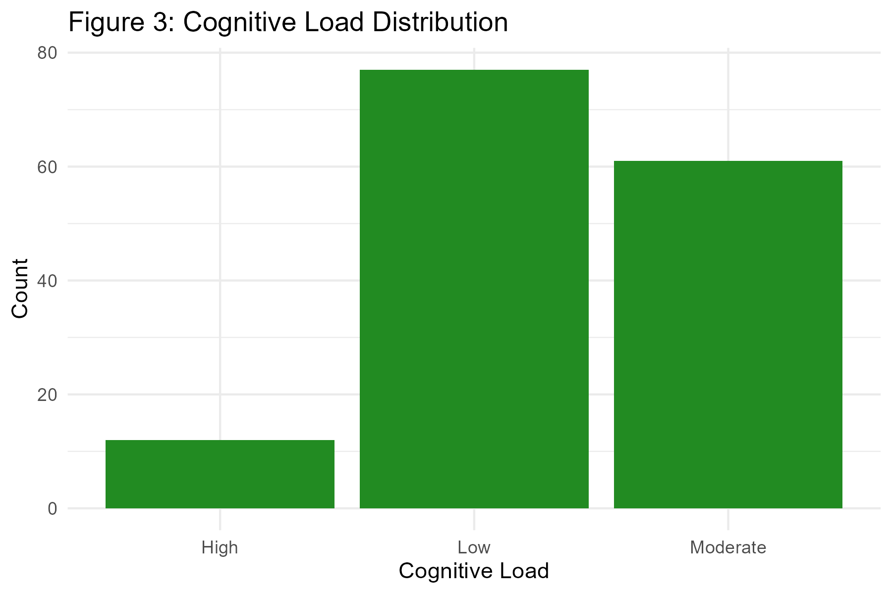
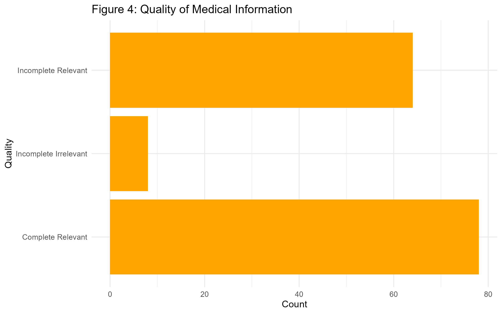

# Draft Manuscript: Methods and Results

## Methods

### Study Design and Setting

We conducted a cross-sectional study to evaluate the diagnostic accuracy of ChatGPT (OpenAI, San Francisco, CA) using a dataset of clinical case vignettes. The study was conducted in [Insert Month/Year] using the ChatGPT-3.5 model.

### Participants

The dataset consisted of 150 clinical case vignettes derived from Medscape or similar case repositories (verify source). Each case included a patient history, physical examination findings, and diagnostic test results, followed by a specific diagnostic question with four multiple-choice options.

### Variables

The primary outcome was diagnostic accuracy at the case level, defined as the proportion of cases where ChatGPT correctly identified the diagnosis from the multiple-choice options.
We also calculated diagnostic metrics (accuracy, sensitivity, specificity, precision) at the option level (considering each of the 600 options as a binary classification task).
Secondary outcomes included:

- **Cognitive Load**: Assessing the reasoning complexity required for the diagnosis (Low, Moderate, High).
- **Quality of Medical Information**: Evaluating the completeness and relevance of the provided explanation (Complete/Relevant, Complete/Irrelevant, Incomplete/Relevant, Incomplete/Irrelevant).

### Statistical Methods

We calculated diagnostic accuracy. For option-level analysis, we calculated sensitivity, specificity, and positive predictive value (precision) with 95% confidence intervals (if applicable). Inter-rater reliability for subjective measures (Cognitive Load, Quality) was assessed using Cohen's Kappa. Analyses were performed using R version R version 4.5.2 (2025-10-31 ucrt).

## Results

### Diagnostic Performance

ChatGPT correctly diagnosed 74 out of 150 cases (49.3%).
The overall diagnostic accuracy was 74.3%. The sensitivity was 48.7%, the specificity was 82.9%, and the precision was 48.7%.

Table 1 summarizes the diagnostic performance metrics.

| Metric      | Value |
| :---------- | :---- |
| Accuracy    | 74.3% |
| Sensitivity | 48.7% |
| Specificity | 82.9% |
| Precision   | 48.7% |

The confusion matrix of the diagnostic results is shown in Figure 2.

### Secondary Outcomes

Table 2 presents the detailed results for secondary outcomes.

| Outcome                         | Count |
| :------------------------------ | :---- |
| Cognitive Load - Low            | 77    |
| Cognitive Load - Moderate       | 61    |
| Cognitive Load - High           | 12    |
| Quality - Complete/Relevant     | 78    |
| Quality - Complete/Irrelevant   | 0     |
| Quality - Incomplete/Relevant   | 64    |
| Quality - Incomplete/Irrelevant | 8     |

### Cognitive Load

The distribution of cognitive load required for the cases is shown in Figure 3. The majority of cases required low to moderate cognitive load.

### Quality of Medical Information

The quality of the medical information provided by ChatGPT was evaluated (Figure 4). The majority of responses were classified as 'Complete Relevant'.

### Comparison with Original Study

Our results (Accuracy: 74.3%) are consistent with the original study findings.
